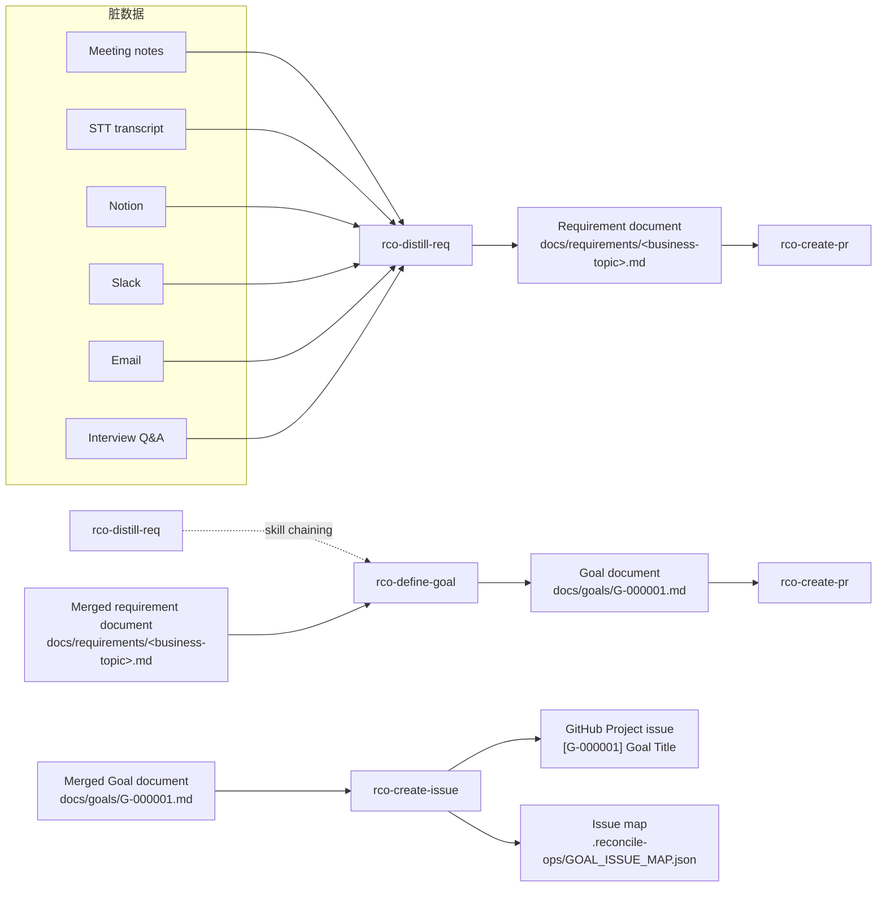

# ReconcileOps Workflow

```mermaid
flowchart LR
  subgraph dirty["脏数据"]
    meeting["Meeting notes"]
    stt["STT transcript"]
    notion["Notion"]
    slack["Slack"]
    email["Email"]
    interview["Interview Q&A"]
  end
  distill["rco-distill-req"]
  req["Requirement document<br/>docs/requirements/&lt;business-topic&gt;.md"]
  reqPrSkill["rco-create-pr"]

  mergedReq["Merged requirement document<br/>docs/requirements/&lt;business-topic&gt;.md"]
  chainedDistill["rco-distill-req"]
  define["rco-define-goal"]
  goal["Goal document<br/>docs/goals/G-000001.md"]
  goalPrSkill["rco-create-pr"]

  mergedGoal["Merged Goal document<br/>docs/goals/G-000001.md"]
  issueSkill["rco-create-issue"]
  issue["GitHub Project issue<br/>[G-000001] Goal Title"]
  map["Issue map<br/>.reconcile-ops/GOAL_ISSUE_MAP.json"]

  meeting --> distill
  stt --> distill
  notion --> distill
  slack --> distill
  email --> distill
  interview --> distill
  distill --> req --> reqPrSkill

  chainedDistill -. skill chaining .-> define
  mergedReq --> define --> goal --> goalPrSkill

  mergedGoal --> issueSkill --> issue
  issueSkill --> map
```
